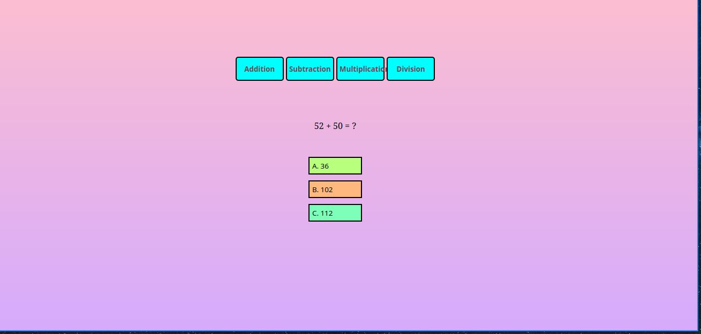

# RandomMathQuestionGenerator
Random math generator that generate random numbers and asks you to answer it 

live preview :
[danialdev01.github.io/RandomMathGeneratorOfRandomness/](https://danialdev01.github.io/RandomMathGeneratorOfRandomness/)

## Features incude :
- Random math question 
- Random wrong answer 
- Random button sequence placement
- Random button color

## Examples :
### Default page

### If user press wrong answer button

### If user press wrong answer button

